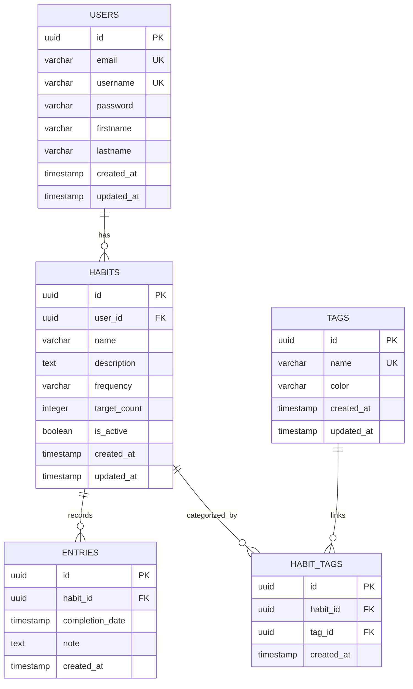

# Database Schema Overview

This document explains the current database structure from `src/db/schema.ts`.

## ER Diagram

## Table Purpose

- `users`: Stores user identity, credentials, and profile metadata.
- `habits`: Stores each habit definition owned by a user.
- `entries`: Stores each completion event for a habit.
- `tags`: Stores reusable labels (for grouping/filtering habits).
- `habit_tags`: Join table for the many-to-many relation between habits and tags.

## Example Rows (Conceptual)

| Table | id | Main fields (example) |
|---|---|---|
| `users` | `u1` | `email: sara@mail.com`, `username: sara` |
| `habits` | `h1` | `user_id: u1`, `name: Morning Run`, `frequency: daily` |
| `entries` | `e1` | `habit_id: h1`, `completion_date: 2026-02-24T06:30:00Z` |
| `tags` | `t1` | `name: Health`, `color: #22C55E` |
| `habit_tags` | `ht1` | `habit_id: h1`, `tag_id: t1` |

### Quick Relationship Walkthrough

1. User `u1` owns habit `h1`.
2. Habit `h1` has one completion entry `e1`.
3. Habit `h1` is tagged with `t1` through `habit_tags` row `ht1`.
